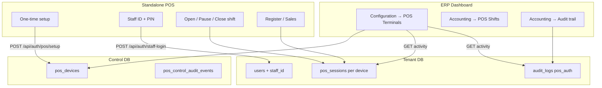

# POS Architecture Roadmap — Full Implementation Documentation

This document explains **everything that was built** to complete the [POS Architecture Roadmap](.cursor/plans/pos_architecture_roadmap_113ec05b.plan.md). It is written in simple English for developers, managers, and operators.

**Goal:** Evolve Qoondeeye from a basic POS setup into a cloud-native system similar to Dynamics 365 Commerce / LS Central — with secure device binding, terminal management, shifts, audit trails, and production rollout support.

**Starting point:** ~65% of the vision was already done.  
**End state:** All 9 priorities (P1–P9) plus tests, runbook, and UI polish are implemented.

---

## Table of contents

1. [How the system fits together](#1-how-the-system-fits-together)
2. [Problems we fixed](#2-problems-we-fixed)
3. [Work by priority (P1–P9)](#3-work-by-priority-p1p9)
4. [Database changes](#4-database-changes)
5. [Backend API reference](#5-backend-api-reference)
6. [ERP UI pages (where to click)](#6-erp-ui-pages-where-to-click)
7. [Standalone POS app](#7-standalone-pos-app)
8. [Environment variables](#8-environment-variables)
9. [Tests](#9-tests)
10. [Rollout and monitoring](#10-rollout-and-monitoring)
11. [Files created (new)](#11-files-created-new)
12. [Files changed or removed](#12-files-changed-or-removed)
13. [End-to-end flows](#13-end-to-end-flows)

---

## 1. How the system fits together

There are **four main parts**:

| Part | App folder | URL (production example) | Role |
|------|------------|--------------------------|------|
| **ERP dashboard** | `apps/qoondeeye-pharmacy` | Pharmacy ERP site | Managers create terminals, view shifts, audit trail, approve variance |
| **Standalone POS** | `apps/pos` | `pos.qoondeeye.online` | Cashiers: setup → PIN login → open shift → sell → close shift |
| **API server** | `apps/qoondeeye-pharmacyDB` | `api.qoondeeye.online` | All auth, terminals, sessions, audit, sales |
| **Platform admin** | `apps/admin-dashboard` | Admin site | Tenant provisioning (separate from POS roadmap core) |

**Two databases:**

- **Control DB** (`public` schema): Shared across all tenants. Stores `pos_devices` (terminals), `tenants`, `pos_control_audit_events`.
- **Tenant DB** (one database per pharmacy): Stores staff, sales, `pos_sessions`, `audit_logs` with `table_name = 'pos_auth'`.



**Typical day for a cashier:**

1. Open POS app on the register (device must already be set up).
2. Enter **Staff ID + PIN** (managers use the same — no separate email login on POS).
3. **Open shift** — enter opening cash float.
4. Sell products on the register.
5. Supervisor can **pause/lock** the register if needed.
6. **Close shift** — count cash, post statement, Z-report.
7. Manager can review shifts and audit in the ERP.

---

## 2. Problems we fixed

| # | Problem | Solution |
|---|---------|----------|
| 1 | `/staff-login` worked without a bound device; security gap | **P4:** `device-binding-guard` redirects to setup if no valid credential |
| 2 | Manager email login remnants confused users | **P3:** Removed manager login page; `/login` redirects; staff PIN for all roles |
| 3 | Terminal list capped at ~50 items, no server filters | **P1:** Server pagination (25–200), search, branch/status/binding filters |
| 4 | Terminal UI was one 700+ line file | **P1:** Split into table, filters, dialogs, hooks |
| 5 | Tenant code optional at setup — cross-tenant risk | **P2:** Required in UI + DTO; `POS_SETUP_REQUIRE_TENANT_CODE` env flag |
| 6 | Redis lockout incomplete; per-server memory drift | **P5:** Device-credential + IP lockout keys; prod requires Redis |
| 7 | Terminal mutations lacked `updated_by` and full audit | **P6:** `updated_by_user_id` column, reactivate endpoint, audit on all mutations |
| 8 | No terminal activity screen | **P7:** Activity API + ERP page with Sessions / Audit / Failures tabs |
| 9 | `GET /terminals/:id/activity` returned 503 — `s.created_at` missing on sales | Fixed query to use `s.sale_date` instead |
| 10 | Shifts were branch-scoped, auto-opened silently | **P8:** Per-device shifts, opening cash dialog, pause/resume, close-shift flow |
| 11 | No ERP report for shifts / variance approval | **P8:** `/accounting/pos-shifts` page + `GET /api/pos/reports/shifts` |
| 12 | POS Shifts page showed configuration tabs wrongly | Replaced `ConfigurationModuleShell` with `ErpWorkbenchShell` |
| 13 | POS Shifts missing from accounting menu | Added to `accounting-hub-menus.ts` and `app-sidebar.tsx` |
| 14 | Audit logs incomplete; no control DB audit | **P9:** `pos_control_audit_events` + expanded `PosAuditService` |
| 15 | Audit trail showed UUIDs instead of names | **Audit trail UX:** `actor_name` + `record_label` in API and UI |
| 16 | No global POS audit query | **P9:** `GET /api/audit/pos` + `getPosGlobalAudit()` in ERP service |
| 17 | No rollout guide | `pos-terminal-rollout-runbook.md` updated with shifts, monitoring, smoke tests |

---

## 3. Work by priority (P1–P9)

### P1 — POS Terminal Management UI

**Backend**

- Extended `GET /api/pos/terminals` with query params: `q`, `branchId`, `status`, `bindingStatus`, `page`, `limit` (max 200).
- Enriched list/detail with `createdByName`, `updatedByName`, `lastSetupAttemptAt`, masked `deviceFingerprint`.
- Added `POST /api/pos/terminals/:id/reactivate`.
- All mutations set `updated_by_user_id`.

**ERP frontend**

- Refactored `configuration-pos-terminals-client.tsx` into small components.
- Added `use-erp-pos-terminals.ts` and `use-pos-terminal-mutations.ts`.
- Virtual table (`@tanstack/react-virtual`) when more than 50 rows on screen.
- Page size selector: 25 / 50 / 100 / 200.
- Skeleton loading, empty states, debounced search (300ms).

**Permissions:** `view_pos_terminals`, `manage_pos_terminals`.

---

### P2 — Required Tenant Code

- `PosSetupDto` and shared Zod schema require `tenantCode`.
- POS setup UI labels tenant code as **required** with helper text.
- Backend validates code against tenant `schema_name`, `subdomain`, `slug`.
- Mismatch returns `403 TENANT_TERMINAL_MISMATCH`.
- Rollout flag: `POS_SETUP_REQUIRE_TENANT_CODE` (can stay `false` during migration).

---

### P3 — Remove Manager Email Login from POS

- Deleted `manager-login-page.tsx`.
- `apps/pos/app/login/page.tsx` redirects to home.
- Removed dead "MGR Login" button from transactions.
- Renamed manager button handler to staff switch on register screen.
- Email/password login remains **ERP only** (`POST /api/auth/login`).

Managers on POS use **Staff ID + PIN** like everyone else. Elevated actions use RBAC permissions server-side.

---

### P4 — Force Device Binding Before PIN Login

**New module:** `apps/pos/features/auth/model/device-binding-guard.ts`

Returns either:

- `setup_required` (missing / revoked / inactive / invalid credential), or
- `ready` (valid bound terminal).

**Used by:**

- `pos-session-gate.tsx` — blocks register without binding
- `staff-login/page.tsx` — redirects to setup instead of showing PIN form
- `device-binding-required.tsx` — user-facing message

**Backend:** `GET /api/auth/pos/device-status` with `Authorization: Device {credential}` returns terminal status without attempting PIN login.

---

### P5 — Redis Rate Limiting

**Service:** `pos-auth-rate-limit.service.ts`

| Attack vector | Redis lock key pattern | Max failures | Window |
|---------------|------------------------|--------------|--------|
| Setup bad password | `setup:{terminalUsername}` | 5 | 5 min |
| Staff PIN | `pin:{deviceId}:{staffId}` | 5 | 5 min |
| Device credential brute force | `cred:{deviceId}` | 10 | 15 min |
| Username enumeration by IP | `user:{ip}:{terminalUsername}` | 10 | 15 min |

All keys prefixed with `pos:auth:lock:`.

**Production:** `POS_RATE_LIMIT_REDIS_REQUIRED=true` → API returns 503 if Redis is down (no silent in-memory fallback).

**Logs:** Structured JSON with `kind: pos_auth_lockout_triggered` or `pos_auth_lockout_active`.

---

### P6 — Revoke / Reset / Deactivate Polish

| ERP action | Result on device | POS impact |
|------------|------------------|------------|
| Reset password | `unbound`, new setup hash | Must run setup again |
| Revoke binding | `revoked`, secret cleared | Immediate auth failure |
| Deactivate | `inactive` | Auth failure |
| Reactivate | `active` | Can setup/login if unbound/bound |

Each action:

- Sets `updated_by_user_id` on `pos_devices`
- Writes to `pos_control_audit_events` and/or tenant `audit_logs`

**UI:** Separate confirmation dialogs for reset, revoke, deactivate.

---

### P7 — POS Terminal Activity Screen

**Route:** `/configuration/pos-terminals/[id]`

**API:** `GET /api/pos/terminals/:id/activity`

Returns:

- Terminal detail from control DB
- Current open/paused session + cashier name
- Stats: sales last 24h, login failures last 24h
- Paginated: recent sessions, audit events, login failures

**ERP tabs:** Sessions | Audit trail | Login failures

**Fix applied:** Sales count query uses `sales.sale_date` (not non-existent `created_at`).

---

### P8 — POS Shift Management

**Database (tenant):** See [§4](#4-database-changes) — `pos_shift_extensions` migration.

**Backend APIs:**

- `POST /api/pos/sessions/open` — opening cash + device + staff
- `POST /api/pos/sessions/:id/pause` — lock register
- `POST /api/pos/sessions/:id/resume` — unlock
- `POST /api/pos/sessions/:id/close` — closing cash (allows paused sessions)
- `POST /api/pos/sessions/:id/approve-variance` — manager approval
- `GET /api/pos/sessions/current?deviceId=` — includes `opening_cash`
- `GET /api/pos/reports/shifts` — filtered shift list for ERP

**POS app UI:**

- `open-shift-prompt.tsx` — opening float after PIN login (replaces silent auto-open)
- `shift-banner.tsx` — cashier, opened time, opening cash, lock/resume, close link
- `shift-paused-overlay.tsx` — blocks sales when paused
- `app/close-shift/` — cash count → statement → close session
- `pos-context.tsx` — session state, pause/resume, block sales when paused
- `pos-action-row.tsx` — supervisor Lock / Resume / Close Shift buttons

**ERP UI:**

- `/accounting/pos-shifts` — list shifts, approve variance, **Close shift** link to POS statement for open/paused shifts (manager force-close path)

---

### P9 — POS Terminal Audit Logs

**Control DB table:** `pos_control_audit_events` — terminal lifecycle (create, update, reset, revoke, deactivate, reactivate).

**Tenant DB:** Continues `audit_logs` with `table_name = 'pos_auth'` for staff login, setup, shift events.

**Services:**

- `pos-audit.service.ts` — writes tenant audit rows (never logs passwords/PINs)
- `pos-control-audit.service.ts` — writes control audit rows
- `pos-audit-query.service.ts` — lists and sanitizes payloads (strips forbidden keys)
- `pos-audit.controller.ts` — `GET /api/audit/pos` global viewer

**ERP integration:**

- Activity screen audit tab (per terminal)
- **Accounting → Audit trail** — filter **POS auth only**
- `getPosGlobalAudit()` in `lib/services/pos-terminals.ts`
- **Audit trail names:** `audit-trail-query.util.ts` adds `actor_name` and `record_label` (staff names, terminal usernames, receipt numbers — not raw UUIDs)

---

## 4. Database changes

### Control DB migrations (`prisma/control/migrations/`)

| Migration | What it does |
|-----------|--------------|
| `20260610090000_database_per_tenant_control` | Control schema for multi-tenant architecture |
| `20260611090000_pos_terminal_setup` | POS terminal setup fields |
| `20260611100000_pos_devices_indexes` | Indexes on `pos_devices` for list filters |
| `20260611120000_pos_devices_updated_by` | `updated_by_user_id` on `pos_devices` |
| `20260611130000_pos_control_audit` | `pos_control_audit_events` table |

### Tenant DB migrations (`prisma/tenant/migrations/`)

| Migration | What it does |
|-----------|--------------|
| `20260610091000_init_public_tenant` | Per-tenant DB init |
| `20260610100000_erp_extensions` | ERP extensions |
| `20260611120000_roles_metadata` | Roles metadata |
| `20260611130000_pos_shift_extensions` | Shift columns, per-device unique open session, indexes |

**Key tenant shift changes:**

```sql
-- New columns on pos_sessions
opening_cash, closing_cash, paused_at, reopened_at,
variance_approved_by, variance_approved_at

-- One open/paused session per device (not per branch)
UNIQUE INDEX pos_sessions_one_open_per_device ON (device_id)
  WHERE status IN ('open','paused') AND device_id IS NOT NULL

-- Performance indexes for activity screen
pos_sessions_device_opened
audit_logs_pos_auth_device
```

**Run migrations:**

```bash
# Control DB
pnpm --filter backend prisma:migrate  # or your control migrate command

# All tenant DBs
pnpm tenant:migrate:all
```

---

## 5. Backend API reference

### Auth (`/api/auth`)

| Method | Path | Purpose |
|--------|------|---------|
| POST | `/pos/setup` | First-time terminal bind (tenant code, username, password) |
| GET | `/pos/device-status` | Check binding without PIN attempt |
| POST | `/staff-login` | Staff ID + PIN with device credential |

### POS terminals (`/api/pos/terminals`) — requires `view_pos_terminals` / `manage_pos_terminals`

| Method | Path | Purpose |
|--------|------|---------|
| GET | `/` | List with filters + pagination |
| GET | `/:id` | Terminal detail |
| GET | `/:id/activity` | Activity aggregate |
| GET | `/:id/audit` | Per-terminal audit log |
| POST | `/` | Create terminal |
| PATCH | `/:id` | Update terminal |
| POST | `/:id/reset-password` | Reset setup password, unbind |
| POST | `/:id/revoke-binding` | Revoke device |
| DELETE | `/:id` | Deactivate |
| POST | `/:id/reactivate` | Reactivate |

### POS sessions (`/api/pos`)

| Method | Path | Purpose |
|--------|------|---------|
| POST | `/sessions/open` | Open shift with opening cash |
| GET | `/sessions/current` | Current session for device |
| POST | `/sessions/:id/pause` | Pause / lock |
| POST | `/sessions/:id/resume` | Resume |
| POST | `/sessions/:id/close` | Close shift |
| POST | `/sessions/:id/approve-variance` | Manager variance approval |
| GET | `/reports/shifts` | ERP shift report (paginated, filters) |

### Audit (`/api/audit`)

| Method | Path | Purpose |
|--------|------|---------|
| GET | `/pos` | Global POS audit (control + tenant events merged) |

### Accounting (`/api/accounting`)

| Method | Path | Purpose |
|--------|------|---------|
| GET | `/audit-trail` | Branch audit log with `tableName` filter; returns `actor_name`, `record_label` |

**Headers (typical ERP request):**

- `X-Tenant: {tenantSlug}` — required
- `x-branch-id: {uuid}` or `all` — branch scope
- `Authorization: Bearer {jwt}` — ERP user

**POS device auth:**

- `Authorization: Device {deviceCredential}` — setup and staff-login

---

## 6. ERP UI pages (where to click)

| Page | URL | What you do here |
|------|-----|------------------|
| **POS Terminals** | `/configuration/pos-terminals` | Create, edit, reset, revoke, deactivate, reactivate terminals |
| **Terminal activity** | `/configuration/pos-terminals/{id}` | Sessions, audit trail, login failures for one register |
| **POS Shifts** | `/accounting/pos-shifts` | View shifts, approve variance, link to close open shifts |
| **Audit trail** | `/accounting/audit-trail` | All branch audit; filter **POS auth only**; shows **names** not UUIDs |
| **POS statement** | `/accounting/pos-statement` | Cash declaration / force-close path for managers |

**Navigation added:**

- Sidebar: Configuration → POS Terminals; Finance → POS Shifts
- Accounting hub menu: Transactions → POS shifts; Audit trail with POS filter

**Permissions:**

- `view_pos_terminals` — list, activity, audit read
- `manage_pos_terminals` — create, edit, reset, revoke, deactivate
- Variance approval — manager role / `pos_approve_variance` (see permissions catalog)

---

## 7. Standalone POS app

| Page / component | Path | Purpose |
|------------------|------|---------|
| Home / launcher | `/` | `PosSessionGate` — setup or launcher |
| Setup | `/setup` | One-time terminal binding |
| Staff login | `/staff-login` | PIN entry (blocked without device binding) |
| Register | `/` (after login) | Sales screen |
| Close shift | `/close-shift` | End-of-day cash count and close |
| `shift-banner.tsx` | On register | Shows cashier, opening cash, lock/resume |
| `shift-paused-overlay.tsx` | On register | Blocks UI when shift is paused |
| `open-shift-prompt.tsx` | After login | Enter opening cash before selling |

**Removed:** Embedded POS from ERP (`pharmacy-pos-page.tsx`, `pos-pin-gate.tsx` deleted). ERP `/pos` redirects to standalone POS URL (`NEXT_PUBLIC_POS_APP_URL`).

---

## 8. Environment variables

### API (`apps/qoondeeye-pharmacyDB`)

```env
# POS setup — require tenant code in production after rollout
POS_SETUP_REQUIRE_TENANT_CODE=true

# Redis required for POS auth lockout in production
POS_RATE_LIMIT_REDIS_REQUIRED=true

# Cashier JWT lifetime (8 hours)
JWT_CASHIER_EXPIRES_IN=28800

# Redis URL must be set and reachable
REDIS_URL=...
```

### ERP (`apps/qoondeeye-pharmacy`)

```env
NEXT_PUBLIC_POS_APP_URL=https://pos.qoondeeye.online
NEXT_PUBLIC_API_URL_LOCAL=http://localhost:5555
```

### Standalone POS (`apps/pos`)

```env
NEXT_PUBLIC_API_URL=https://api.qoondeeye.online
```

---

## 9. Tests

### Backend Jest tests (run in `apps/qoondeeye-pharmacyDB`)

```bash
pnpm test
```

| Test file | What it covers |
|-----------|----------------|
| `auth.device-login.spec.ts` | Device credential, revoked/inactive/bound paths |
| `pos-auth-rate-limit.service.spec.ts` | Lockout trigger and active lock behavior |
| `pos-auth-flow.spec.ts` | Setup → login → revoke flow |
| `pos-audit-query.service.spec.ts` | Payload sanitization strips secrets |
| `pos-terminal-activity.service.spec.ts` | Activity aggregation delegation |
| `auth.dto-sync.spec.ts` | DTO / validation sync |

**Note:** A POS-side vitest file for `device-binding-guard` was removed because the monorepo has no vitest setup. Binding guard behavior is covered by backend device-login tests and POS integration via `staff-login` redirect.

---

## 10. Rollout and monitoring

**Full guide:** `apps/qoondeeye-pharmacyDB/docs/pos-terminal-rollout-runbook.md`

### Deploy order

1. Backend + migrations (control + `tenant:migrate:all`)
2. ERP dashboard
3. Standalone POS app
4. Flip env flags after smoke test
5. Monitor 48 hours

### Where to monitor in the UI (no dedicated dashboard)

| What to watch | Where |
|---------------|-------|
| POS login/setup failures | ERP → **Accounting → Audit trail** → filter **POS auth only** |
| Per-terminal failures | ERP → **Configuration → POS Terminals** → click terminal → **Login failures** tab |
| Open shifts / variance | ERP → **Accounting → POS Shifts** |
| Terminal binding status | ERP → **Configuration → POS Terminals** |

### Where to monitor in logs (Railway / API stdout)

Search for:

- `pos_auth_lockout_triggered`
- `pos_auth_lockout_active`
- `pos_staff_login_failure`
- `pos_terminal_setup_failure`
- HTTP 429 on `/api/auth/staff-login` or `/api/auth/pos/setup`

**Health checks (no tenant header):**

- `GET /api/health`
- `GET /api/health/control-db`

---

## 11. Files created (new)

### Backend — `apps/qoondeeye-pharmacyDB`

| File | What it does |
|------|--------------|
| `src/pos-terminals/pos-terminals.module.ts` | Nest module for terminals + audit query |
| `src/pos-terminals/pos-terminals.controller.ts` | REST routes for terminal CRUD + activity + audit |
| `src/pos-terminals/pos-terminals.service.ts` | Control DB queries, filters, mutations, user/branch name batch load |
| `src/pos-terminals/pos-terminal-activity.service.ts` | Parallel tenant queries for activity screen |
| `src/pos-terminals/pos-terminal-activity.service.spec.ts` | Unit test for activity service |
| `src/pos-terminals/pos-audit.controller.ts` | `GET /api/audit/pos` |
| `src/pos-terminals/pos-audit-query.service.ts` | Global audit list + payload sanitization |
| `src/pos-terminals/pos-audit-query.service.spec.ts` | Unit test for payload allowlist |
| `src/pos-terminals/dto/*.ts` | DTOs for list, create, update, reset, audit query |
| `src/pos-terminals/pos-terminal-status.ts` | Status helpers |
| `src/auth/pos-setup.dto.ts` | Setup validation DTO |
| `src/auth/pos-audit.service.ts` | Writes tenant `audit_logs` for POS events |
| `src/auth/pos-control-audit.service.ts` | Writes control `pos_control_audit_events` |
| `src/auth/pos-auth-rate-limit.service.ts` | Redis lockout for setup, PIN, credential, IP |
| `src/auth/pos-auth-rate-limit.service.spec.ts` | Lockout tests |
| `src/accounting/audit-trail-query.util.ts` | Enriches audit trail with `actor_name`, `record_label` |
| `src/pos-sessions/dto/list-pos-shifts.dto.ts` | Shift report query DTO |
| `src/pos-sessions/dto/current-pos-session-query.dto.ts` | Current session query DTO |
| `src/health/health.controller.ts` | Health endpoints |
| `src/health/health.module.ts` | Health module |
| `docs/pos-terminal-rollout-runbook.md` | Production rollout guide |
| `docs/database-per-tenant-architecture-review.md` | Architecture review doc |
| `docs/database-per-tenant-rollout.md` | DB-per-tenant rollout doc |
| `prisma/control/` | Control schema + migrations |
| `prisma/tenant/` | Tenant schema + migrations |
| `scripts/migrate-all-tenants.ts` | Run migrations on all tenant DBs |
| `scripts/*.ts` | Tenant backup, provision, seed, abandon helpers |
| `test/pos-auth-flow.spec.ts` | End-to-end auth flow test |

### ERP — `apps/qoondeeye-pharmacy`

| File | What it does |
|------|--------------|
| `app/(pharmacy)/configuration/pos-terminals/page.tsx` | Terminals list page |
| `app/(pharmacy)/configuration/pos-terminals/configuration-pos-terminals-client.tsx` | Orchestrator for terminal management |
| `app/(pharmacy)/configuration/pos-terminals/components/terminal-table.tsx` | Virtualized table |
| `app/(pharmacy)/configuration/pos-terminals/components/terminal-filters.tsx` | Branch, status, binding filters |
| `app/(pharmacy)/configuration/pos-terminals/components/terminal-search.tsx` | Search input |
| `app/(pharmacy)/configuration/pos-terminals/components/terminal-pagination.tsx` | Page navigation + page size |
| `app/(pharmacy)/configuration/pos-terminals/components/terminal-form-dialog.tsx` | Create / edit dialog |
| `app/(pharmacy)/configuration/pos-terminals/components/terminal-form-fields.tsx` | Shared form fields |
| `app/(pharmacy)/configuration/pos-terminals/components/terminal-reset-password-dialog.tsx` | Reset confirmation |
| `app/(pharmacy)/configuration/pos-terminals/components/terminal-revoke-dialog.tsx` | Revoke confirmation |
| `app/(pharmacy)/configuration/pos-terminals/components/terminal-deactivate-dialog.tsx` | Deactivate confirmation |
| `app/(pharmacy)/configuration/pos-terminals/components/terminal-status-badge.tsx` | Status / binding badges |
| `app/(pharmacy)/configuration/pos-terminals/[id]/page.tsx` | Activity page route |
| `app/(pharmacy)/configuration/pos-terminals/[id]/pos-terminal-activity-client.tsx` | Activity UI with tabs |
| `app/(pharmacy)/accounting/pos-shifts/page.tsx` | POS Shifts page |
| `app/(pharmacy)/accounting/pos-shifts/pos-shifts-client.tsx` | Shift list, variance approval, close link |
| `hooks/queries/use-erp-pos-terminals.ts` | TanStack Query for terminal list |
| `hooks/queries/use-erp-pos-shifts.ts` | TanStack Query for shift report |
| `hooks/use-pos-terminal-mutations.ts` | Create/update/reset/revoke/deactivate mutations |
| `lib/services/pos-terminals.ts` | API client for terminals + activity + global audit |
| `lib/pos-terminals/format-date.ts` | Date formatting helper |
| `lib/pos-terminals/terminal-status.ts` | Badge variant helpers |
| `lib/pos-app-url.ts` | Standalone POS URL helper |

### Standalone POS — `apps/pos`

| File | What it does |
|------|--------------|
| `app/setup/page.tsx` | Terminal setup page |
| `app/close-shift/page.tsx` | Close shift route |
| `app/close-shift/close-shift-client.tsx` | Close shift UI flow |
| `components/open-shift-prompt.tsx` | Opening cash dialog |
| `components/shift-banner.tsx` | Active shift info bar |
| `components/shift-paused-overlay.tsx` | Blocks register when paused |
| `features/auth/model/device-binding-guard.ts` | Binding state machine |
| `features/auth/ui/device-binding-required.tsx` | Setup required message UI |

---

## 12. Files changed or removed

### Removed (important)

| File | Why removed |
|------|-------------|
| `apps/pos/features/auth/ui/manager-login-page.tsx` | P3 — no email login on POS |
| `apps/qoondeeye-pharmacy/components/pharmacy-pos/pharmacy-pos-page.tsx` | POS moved to standalone app |
| `apps/qoondeeye-pharmacy/components/pharmacy-pos/pos-pin-gate.tsx` | Same — embedded POS removed |
| `apps/qoondeeye-pharmacyDB/scripts/provision-tenant-schema.sql` | Replaced by per-tenant migration scripts |

### Modified (grouped by area)

**POS app (`apps/pos`):**

- `pos-session-gate.tsx`, `staff-login-page.tsx` — device binding guard
- `pos-context.tsx` — shift session, pause/resume, block sales when paused
- `pos-action-row.tsx` — lock/resume/close shift buttons
- `lib/services/pos-sessions.ts` — pause, resume, current session with opening cash
- `lib/services/auth.ts`, `lib/device-client.ts` — setup, device-status, credential storage
- `lib/validation.ts` — required tenant code
- `app/login/page.tsx` — redirect away from email login
- `register-screen.tsx`, `footer.tsx`, `proxy.ts` — cleanup and routing

**ERP (`apps/qoondeeye-pharmacy`):**

- `audit-trail-client.tsx` — POS auth filter + display names
- `app-sidebar.tsx`, `accounting-hub-menus.ts`, `accounting-nav-config.ts`, `routes.ts` — navigation for POS Terminals and POS Shifts
- `lib/services/accounting.ts` — `AuditLogRow` extended with `actor_name`, `record_label`
- `lib/services/pos-sessions.ts` — shift list and variance approval
- `lib/erp-query-keys.ts` — query keys for terminals, shifts, activity
- `package.json` — added `@tanstack/react-virtual`

**Backend (`apps/qoondeeye-pharmacyDB`):**

- `auth.service.ts` — tenant code, device login, audit events, rate limits
- `auth.controller.ts` — setup, device-status, staff-login
- `pos-sessions.service.ts` — per-device shifts, pause/resume, shift report, variance
- `pos-sessions.controller.ts` — new session endpoints
- `accounting.controller.ts` — audit-trail enrichment via util
- `app.module.ts` — PosTerminalsModule, HealthModule
- `permission-catalog.ts` — POS terminal permissions
- `prisma.service.ts`, tenant modules — database-per-tenant support

**Shared packages:**

- `packages/validation/src/auth.ts` — required `tenantCode` in setup schema

---

## 13. End-to-end flows

### A. First-time terminal setup

1. Manager creates terminal in ERP (username, setup password, branch).
2. Cashier opens POS → redirected to **Setup**.
3. Enters API URL, **tenant code**, terminal username, setup password.
4. `POST /api/auth/pos/setup` validates tenant code, binds device, returns `deviceCredential`.
5. POS stores credential locally. Terminal shows as **bound** in ERP.

### B. Daily login and shift

1. POS checks `device-binding-guard` → credential valid → show launcher.
2. Cashier goes to **Staff login** → `POST /api/auth/staff-login`.
3. **Open shift** dialog → `POST /api/pos/sessions/open` with opening cash.
4. Register unlocked; `shift-banner` shows cashier and float.
5. Sales attach to `pos_session_id` for this device.

### C. Pause and close

1. Supervisor taps **Lock** → `POST /api/pos/sessions/:id/pause`.
2. `shift-paused-overlay` blocks new sales.
3. **Resume** → `POST /api/pos/sessions/:id/resume`.
4. **Close shift** → `/close-shift` → cash count → statement → `POST close`.

### D. Manager oversight in ERP

1. **POS Shifts** — see open/closed shifts, approve variance, force-close link.
2. **Terminal activity** — sessions, audit, login failures per device.
3. **Audit trail (POS auth only)** — tenant-wide POS security events with readable names.

### E. Revoke lost terminal

1. ERP → **Revoke binding** on terminal.
2. Control DB: `binding_status = revoked`, secret cleared.
3. Next POS login or device-status check → `setup_required`.
4. POS clears local credential and shows setup screen.

---

## Quick reference — implementation checklist

| Priority | Status | Key deliverable |
|----------|--------|-----------------|
| P1 Terminal UI | Done | Filters, pagination, virtual table, dialogs |
| P2 Tenant code | Done | Required + env flag |
| P3 No manager email on POS | Done | Staff PIN only |
| P4 Device binding | Done | Guard + device-status API |
| P5 Redis lockout | Done | Multi-vector keys + prod flag |
| P6 Revoke/reset polish | Done | updated_by, reactivate, audit |
| P7 Activity screen | Done | API + ERP tabs |
| P8 Shifts | Done | Per-device sessions, POS + ERP UI |
| P9 Audit | Done | Control table, global API, audit trail names |
| Tests + runbook | Done | Jest specs + `pos-terminal-rollout-runbook.md` |

---

## Related documents

- Plan source: `.cursor/plans/pos_architecture_roadmap_113ec05b.plan.md`
- Rollout runbook: `apps/qoondeeye-pharmacyDB/docs/pos-terminal-rollout-runbook.md`
- DB architecture: `apps/qoondeeye-pharmacyDB/docs/database-per-tenant-architecture-review.md`
- DB rollout: `apps/qoondeeye-pharmacyDB/docs/database-per-tenant-rollout.md`
- POS app README: `apps/pos/README.md`
- API README: `apps/qoondeeye-pharmacyDB/README.md`

---

*Last updated: June 2026 — reflects full POS Architecture Roadmap implementation (P1–P9) including audit trail name display and ERP navigation fixes.*
