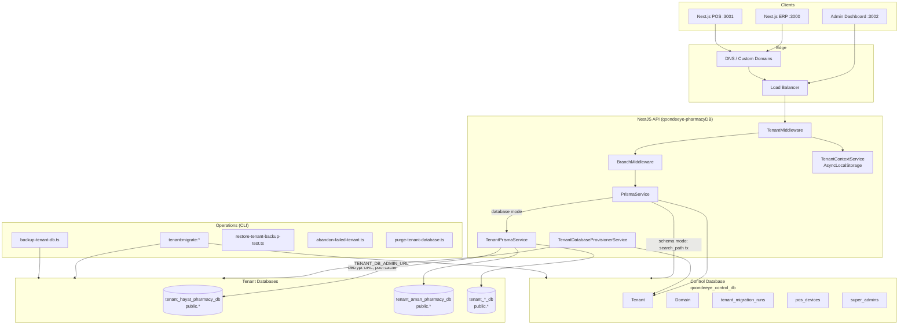
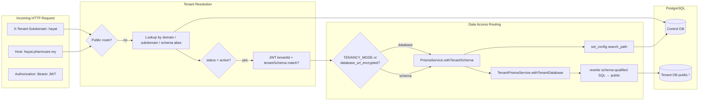
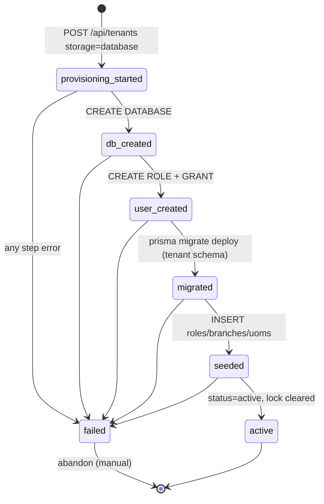

# Database-Per-Tenant Architecture Review

**System:** Qoondeeye Pharmacy ERP/POS (multi-tenant SaaS)  
**Review date:** 2026-06-10  
**Reviewer perspective:** Senior Staff Engineer · PostgreSQL Architect · Prisma Expert · SaaS Platform Architect  
**Scope:** Implementation in `apps/qoondeeye-pharmacyDB` and related rollout tooling  
**Target scale:** Hundreds of pharmacy tenants (10 → 1000 trajectory)

---

## 1. Executive Architecture Review

### Verdict

The database-per-tenant design is **architecturally sound and appropriate** for a regulated, data-isolated pharmacy ERP/POS platform. The hybrid rollout strategy (`TENANCY_MODE=schema` during migration, per-tenant routing via `database_url_encrypted`) is pragmatic and reduces big-bang risk.

The implementation shows mature thinking in several areas:

- **Single access gate:** `PrismaService.withTenantSchema()` delegates to `TenantPrismaService` for database-mode tenants.
- **Encrypted credentials at rest** in the control plane only (AES-256-GCM).
- **Per-tenant PostgreSQL roles** with database ownership — strong isolation boundary at the DB layer.
- **Operational scripts** for provision, migrate, backup, restore-test, abandon, purge, and rollout automation.
- **Schema SQL guard** (`tenant:guard:schema-sql`) — currently reports zero violations, meaning the codebase is ready for `TENANCY_MODE=database` from a SQL-qualification standpoint.

However, the system is **not production-ready at scale** without addressing:

1. **Unauthenticated control-plane API** (`/api/tenants` is public — no JWT/system-user guard).
2. **Local-only backups** (no S3/object-store pipeline, retention, or encryption-at-rest policy).
3. **No credential rotation** for tenant DB users.
4. **Connection math at scale** (per-instance client cache × pool size vs. PostgreSQL `max_connections`).
5. **Incomplete post-migration verification** (row counts logged, no checksum/reconciliation gate).
6. **Missing `tenant:backup` npm script** (script exists; not wired in `package.json`).

**Production Readiness Score: 62 / 100** (see Section 13).

### Architecture Pattern Summary

| Layer | Responsibility | Storage |
|-------|----------------|---------|
| Control DB (`qoondeeye_control_db`) | Tenant registry, domains, subscriptions metadata, POS device registry, migration runs, encrypted DB URLs, system admins | PostgreSQL `public` |
| Tenant DB (`tenant_{slug}_db`) | Users, branches, inventory, sales, purchases, accounting, audit logs | PostgreSQL `public` only |
| Application | Tenant resolution, routing, connection pooling, provisioning | NestJS + Prisma + `pg` Pool |

**Legacy mode:** `TENANCY_MODE=schema` — one PostgreSQL database, one schema per tenant (`tenant_hayat.products`).  
**Target mode:** `TENANCY_MODE=database` — one PostgreSQL database per tenant, all tables in `public`.

The `schema_name` column persists as a **logical tenant identifier** (JWT `tenantSchema`, routing alias) even in database mode. This is correct for backward-compatible tokens and URLs, but naming is confusing for new engineers — document it explicitly as *logical schema name*, not *physical PostgreSQL schema*.

---

## 2. Architecture Diagram



---

## 3. Data Flow Diagram



**Key invariant:** Application services never receive `databaseUrl`, `databaseName`, or `PrismaClient` from HTTP input. URLs are read only from control DB rows inside `TenantPrismaService`.

---

## 4. Tenant Request Lifecycle

### Resolution order (`TenantMiddleware`)

1. **OPTIONS** — pass through.
2. **Public routes** — skip tenant binding (`/api/auth`, `/api/tenants`, `/api/domains`, `/api/system-users`, `/api`).
3. **Header resolution** (priority):
   - `X-Tenant-Subdomain` (preferred)
   - Legacy `X-Tenant`
   - Reject reserved subdomains (`admin`, `api`, `www`, `app`, `support`, `docs`).
4. **Host resolution** — extract subdomain from `Host` header; match custom domain via `Domain` table, then subdomain, then schema name.
5. **Active-only lookup** — `findBySubdomain` / `findBySchemaName` filter `status = 'active'`.
6. **Inactive handling** — if a row exists but is not active → `403 TENANT_SUSPENDED` (covers `suspended`, `provisioning`, `migration_failed`, `deleted`).
7. **JWT binding** — for `type: tenant_user`, enforce `tenantId` and `tenantSchema` match resolved tenant → `403 TENANT_MISMATCH`.
8. **Context propagation** — `TenantContextService` (AsyncLocalStorage) + `req.tenant*` fields.
9. **Schema patches** — `applyTenantSchemaPatches(schemaName)` (legacy compatibility DDL).

### Branch scope (`BranchMiddleware` + `BranchScopeGuard`)

After tenant resolution, authenticated ERP/POS routes require JWT and branch scope. Tenant tokens must match resolved schema. This is a **second isolation layer** for multi-branch pharmacies.

### Validation assessment

| Requirement | Status | Notes |
|-------------|--------|-------|
| Reserved subdomains rejected | ✅ | `RESERVED_TENANT_SUBDOMAINS` |
| Suspended tenants blocked | ✅ | Non-active → `TENANT_SUSPENDED` |
| Deleted tenants blocked | ✅ | `status = 'deleted'` is not active |
| JWT tenant validation | ✅ | Middleware + BranchMiddleware |
| Distinct error for deleted vs suspended | ⚠️ | Both return `TENANT_SUSPENDED` |
| Provisioning tenants blocked from ERP | ✅ | `provisioning` ≠ active |

### Risk: public control-plane routes

`/api/tenants` bypasses tenant middleware **and** has **no system-user authentication guard**. Anyone who can reach the API can list tenants, create tenants, suspend, delete, and abandon. This is the **single highest-severity finding** in this review.

---

## 5. Provisioning Lifecycle

### New database-mode tenant flow



### Step-by-step (from `TenantDatabaseProvisionerService`)

1. **Advisory transaction lock** — `pg_advisory_xact_lock(hashtext('tenant-provision:{slug}'))` during control row insert.
2. **Conflict check** — slug, subdomain, schema_name, database_name uniqueness.
3. **Control row** — `status=provisioning`, `provisioning_status=provisioning_started`, `provisioning_lock_id`.
4. **CREATE DATABASE** `tenant_{slug}_db` (idempotent if exists — see risk).
5. **CREATE ROLE** `tenant_{slug}_user` with random 24-byte password.
6. **GRANT** database + public schema + default privileges; **ALTER OWNER** to tenant user.
7. **Encrypt URL** — store in `database_url_encrypted` (AES-256-GCM v1).
8. **Migrate** — `prisma migrate deploy --config prisma/tenant/prisma.config.ts`.
9. **Seed** — roles, permissions, main branch, UOMs, price group.
10. **Activate** — `status=active`, `provisioning_status=active`, clear lock.
11. **Record** — `tenant_migration_runs` entry for `tenant:migrate:provision`.

### Provisioning safety review

| Control | Implementation | Assessment |
|---------|----------------|------------|
| Duplicate click protection | Advisory xact lock + unique constraints on slug/DB name | ✅ Good for concurrent creates |
| Cross-request idempotency | Failed slug blocks re-create until abandon | ⚠️ Operational friction, but safe |
| Rollback on failure | Status → `migration_failed`; **no automatic DB/role drop** | ❌ Orphan resources |
| Partial state recovery | `abandon` API/CLI drops DB+role+control row | ✅ For pre-active tenants |
| Re-provision same slug after abandon | Allowed after control row deleted | ✅ |
| Idempotent CREATE DATABASE | Skips if DB exists | ⚠️ Dangerous if stale DB from crash |
| Provisioning lock usage | Stored but not checked on resume | ⚠️ Lock is audit-only post-insert |

**Opinion:** Failed provisioning should call `teardownDedicatedDatabase()` in a `finally` block unless explicitly retained for debugging. The current design correctly favors **manual abandon** over automatic destructive rollback, but operators must know orphaned DBs accumulate.

---

## 6. Migration Lifecycle

### Phase plan (validated against codebase)

| Phase | Action | Tooling |
|-------|--------|---------|
| **Phase 1** | Create net-new database-mode tenant; smoke ERP/POS flows | `POST /api/tenants` + `storage: "database"`, `tenant:rollout:smoke` |
| **Phase 2** | Migrate one small legacy schema tenant | `pnpm tenant:migrate:schema-to-database -- --tenant=<slug>` |
| **Phase 3** | Migrate remainder | `tenant:migrate:all` or `tenant:rollout:complete` |
| **Cutover** | Flip global mode | `TENANCY_MODE=database` when all active tenants have `database_url_encrypted` |

### Schema → database migration (`migrate-schema-to-database.ts`)

1. Sets tenant to `provisioning` during migration (blocks live traffic ✅).
2. Creates DB/user/grants (same as provision).
3. Runs tenant Prisma migrations on empty DB.
4. **Copies data** table-by-table via cursor (`FETCH 250`) from legacy schema in control/shared DB to tenant DB `public`.
5. Uses `session_replication_role = replica` to defer FK checks during bulk insert.
6. Updates control row with encrypted URL; restores `status=active`.
7. Logs migration in `tenant_migration_runs`.

### Migration logging

`tenant_migration_runs` tracks: `tenant_id`, `migration_name`, `status` (`running`/`success`/`failed`), timestamps, `error_message`. Used for provision, schema-to-database, and `tenant:migrate:all`.

### Gaps

| Gap | Severity | Detail |
|-----|----------|--------|
| No row-count reconciliation gate | High | Logs counts per table; no assert `source_count == target_count` |
| No checksum / hash verification | High | Silent column mismatch possible (copies column intersection only) |
| No rollback after cutover | Medium | `--force` re-run requires manual cleanup |
| Legacy schema not dropped post-migration | Medium | Intentional safety; increases storage until manual drop |
| Sequential `migrate:all` | Low | Safe; slow at 500+ tenants |

**Opinion:** Before Phase 2 production cutover, add an automated **verification script** that compares table row counts and `SUM(hashtext(t::text))` samples per table between source schema and target DB. Do not rely on smoke tests alone.

---

## 7. Backup and Restore Lifecycle

### Current backup flow (`scripts/backup-tenant-db.ts`)

1. Lookup active tenant with `database_url_encrypted` in control DB.
2. Decrypt URL in-process.
3. `pg_dump --format=custom` to local `dumps/{database_name}-{timestamp}.dump`.

### Current restore test (`scripts/restore-tenant-backup-test.ts`)

1. Create `{database}_restore_test` database.
2. `pg_dump` source → `pg_restore` to target.
3. Verify row counts for `users`, `branches`, `products`, `sales`, `purchases`.

### Deletion policy (documented + implemented)

```text
suspend → soft delete (30-day scheduled_delete_at) → backup validation → purge (--confirm)
```

`purge-tenant-database.ts` requires `status=deleted` + `--confirm`; drops DB and role; nulls encrypted URL in control row.

### Assessment

| Capability | Status |
|------------|--------|
| Per-tenant logical backup | ✅ Script exists |
| Restore drill | ✅ restore:test |
| npm script for backup | ❌ Missing from package.json |
| Off-site storage | ❌ Local `dumps/` only |
| Scheduled backups | ❌ No cron/job |
| Point-in-time recovery | ❌ No WAL archiving |
| Backup encryption | ❌ Relies on filesystem |
| RTO/RPO defined | ❌ Not in code/docs |
| Cross-region DR | ❌ Not designed |

**Opinion:** For pharmacy regulatory expectations (inventory, controlled substance audit trails), **daily automated backups per tenant DB to object storage with 30/90-day retention** is non-negotiable before production. Restore drills should be monthly and logged.

---

## 8. Security Review

### Tenant isolation

| Boundary | Mechanism | Strength |
|----------|-----------|----------|
| Network | Separate PostgreSQL database per tenant | Strong |
| Authentication | Per-tenant PostgreSQL role | Strong |
| Authorization | Role owns DB + public schema | Strong |
| Application | `TenantPrismaService` cache keyed by tenant UUID | Strong |
| Cross-tenant SQL | No shared tenant tables in database mode | Strong |
| JWT | tenantId + tenantSchema binding | Strong |
| Control plane API | **No auth on /api/tenants** | **Critical weakness** |

Each tenant user receives `ALL PRIVILEGES ON DATABASE` and owns `public`. They **cannot** connect to other tenant databases without credentials. Application-layer bypass (accepting client-supplied URLs) is explicitly prevented by design.

### Encrypted database URLs

- **Algorithm:** AES-256-GCM, version prefix `v1`, random 12-byte IV per encryption.
- **Key:** `TENANT_DATABASE_URL_ENCRYPTION_KEY` (32-byte base64 or 64-char hex).
- **Exposure:** `sanitizeTenant()` strips `databaseUrlEncrypted` from API responses ✅.
- **Logging:** Structured logs include `databaseName` but not URLs ✅.

**Gaps:**

- No key rotation strategy (re-encrypt all URLs on key change).
- Fallback to `DATABASE_URL_ENCRYPTION_KEY` may cause accidental key sharing with other secrets.
- Decrypted URLs exist in application memory for life of cached `TenantClientEntry`.

### Privilege boundaries

- **`TENANT_DB_ADMIN_URL`** — superuser or CREATEDB/CREATEROLE equivalent. Must never be in app runtime env for request-serving pods — **provisioner/migration jobs only**.
- **Tenant DB user** — full owner of one DB. Acceptable for dedicated DB model; consider restricting to schema-level if admin tasks move to separate role.

### Tenant impersonation risks

- **X-Tenant-Subdomain header** — any client can send it; combined with stolen JWT from another tenant → blocked by JWT match ✅.
- **Super-admin cross-tenant** — BranchMiddleware mentions super-admin impersonation via `X-Tenant`; ensure this path is system-user-only and audited.
- **POS device binding** — device credentials scoped to tenant in control DB ✅.

### Cross-tenant access risks

| Vector | Risk | Mitigation |
|--------|------|------------|
| Schema-qualified SQL in database mode | Medium | `rewriteSchemaQualifiedSql` proxy + guard script (0 violations) |
| `queryRawUnsafe` outside transaction wrapper | Low | Routed through delegate when schema detected |
| Background workers (import) | Low | Uses `withTenantSchema` per tenant |
| Shared Redis/cache keys | Unknown | Audit cache key prefixes include tenant id |
| Control DB legacy schemas during hybrid | Medium | Data duplicated until legacy schema dropped |

---

## 9. Performance Review

### Connection model (current defaults)

| Component | Setting | Connections |
|-----------|---------|-------------|
| `PrismaService` (control) | pool max 10 (default) | up to 10 |
| `TenantPrismaService` control pool | max 3 | 3 |
| Per cached tenant client | `TENANT_DB_POOL_MAX=3` | 3 each |
| Max cached tenant clients | `TENANT_PRISMA_MAX_CLIENTS=20` | up to 60 tenant |
| Idle eviction | `TENANT_PRISMA_IDLE_MS=300000` (5 min) | — |
| LRU eviction under pressure | Oldest idle client when at cap | — |

### Per-instance PostgreSQL connection estimate

```text
control: ~13 (10 + 3)
tenant:  up to 20 clients × 3 = 60
total:   ~73 connections per API instance (worst case, warm cache)
```

Prisma uses the `@prisma/adapter-pg` with explicit `pg.Pool` — pool sizing is **deterministic** (good). URL query params do not silently override pool size (good).

### Scale scenarios

#### 10 tenants

- **Traffic pattern:** Likely 1–3 hot tenants per instance; cache hit rate high.
- **Connections:** ~15–25 typical.
- **Bottleneck:** None.
- **Verdict:** ✅ Comfortable.

#### 50 tenants

- **Cache:** 20-client cap means churn if >20 active tenants/instance.
- **Connections:** Eviction keeps ≤73; cold starts add ~200–500ms (connect + `$connect`).
- **Migrations:** `migrate:all` sequential ~50 × (5–30s) = 4–25 min.
- **Verdict:** ✅ Acceptable with 2–4 API instances.

#### 100 tenants

- **Cache churn:** High if traffic spreads evenly — constant connect/disconnect overhead.
- **Connections (cluster):** 4 instances × 73 = 292 worst-case — plan PostgreSQL `max_connections` accordingly.
- **Ops:** Backup 100 DBs sequentially = hours without parallelism.
- **Verdict:** ⚠️ Needs PgBouncer or raised cache + monitoring.

#### 500 tenants

- **Connection storm:** Multiple instances × 60 tenant connections = unsustainable on single PG host without pooling broker.
- **Memory:** ~20 Prisma clients × (~5–15 MB each) = 100–300 MB per instance for clients alone.
- **Migration/deploy:** Must parallelize with worker pool (5–10 concurrent) + rate limits.
- **Verdict:** ❌ Requires architectural additions (below).

#### 1000 tenants

- **Database count:** 1000 PostgreSQL databases on one cluster — operable on RDS/Aurora or self-hosted PG 14+ but requires automation.
- **Connection model breaks** without **PgBouncer per tenant host** or **application-level connection broker**.
- **Control DB** remains small; not the bottleneck.
- **Verdict:** ❌ Not viable on current connection architecture alone.

### Prisma-specific behavior

- Each `TenantClientEntry` = one `PrismaClient` + one `pg.Pool` — correct isolation, expensive at scale.
- `$transaction` timeout 60s / maxWait 15s — appropriate for ERP flows; watch long imports.
- Raw SQL rewrite via `Proxy` — negligible overhead vs network RTT.
- No Prisma Accelerate / edge — self-hosted pools only.

### PgBouncer compatibility (future)

Current design is **compatible** with transaction-pooling PgBouncer if:

1. All tenant queries stay inside `$transaction` (already enforced for database mode via `withTenantDatabase`).
2. Prepared statements disabled or pool mode = session for Prisma (Prisma + transaction mode PgBouncer is the recommended combo).
3. One PgBouncer database entry per tenant DB, or wildcard routing with careful URL structure.

**Recommendation:** Introduce PgBouncer at **50 tenants**, mandatory at **200**.

---

## 10. Failure Scenarios

| Scenario | System behavior | Impact | Recovery |
|----------|-----------------|--------|----------|
| Provisioning fails after CREATE DATABASE | `migration_failed`; DB/user orphan | Slug blocked | `POST /abandon` or CLI |
| Duplicate provision click | Second request: conflict on slug | Safe | N/A |
| TenantPrisma cache at capacity, all busy | `503 No idle tenant database clients` | Request fails | Scale instances or raise MAX_CLIENTS |
| Decrypt failure (wrong key) | Service error on first DB access | Total tenant outage | Fix key from backup KMS |
| Control DB unavailable | All tenant resolution fails | Total platform outage | HA control DB (Patroni/RDS Multi-AZ) |
| Single tenant DB down | Only that tenant affected | Isolated outage | Restore from backup |
| Migration copy partial failure | Transaction rollback per table; tenant `migration_failed` | Tenant offline | Fix data, re-run with `--force` |
| JWT tenant mismatch | 403 TENANT_MISMATCH | User must re-login | Expected |
| Legacy schema SQL in database mode | Guard catches at CI | Build failure | Fix SQL |
| `pg_dump` not installed (Windows) | Backup script fails | No backup | Set `PG_BIN_DIR` |
| Admin URL in app pods | Provisioning works; leak = full PG compromise | Catastrophic | Separate job runner IAM |

---

## 11. Risk Assessment

| ID | Risk | Likelihood | Impact | Priority |
|----|------|------------|--------|----------|
| R1 | Unauthenticated `/api/tenants` | High | Critical | P0 |
| R2 | No automated off-site backup | Medium | Critical | P0 |
| R3 | Migration without verification gate | Medium | High | P0 |
| R4 | Connection exhaustion at scale | Medium | High | P1 |
| R5 | Orphan DBs after failed provision | Medium | Medium | P1 |
| R6 | No encryption key rotation | Low | High | P1 |
| R7 | `TENANT_DB_ADMIN_URL` in app runtime | Low | Critical | P1 |
| R8 | Idempotent CREATE DATABASE masks stale DB | Low | Medium | P2 |
| R9 | Deleted tenant same error as suspended | Low | Low | P3 |
| R10 | Hybrid mode dual storage (schema + DB) | Medium | Medium | P2 until cutover |
| R11 | Sequential ops scripts don't scale | High | Medium | P2 at 50+ tenants |
| R12 | Missing `tenant:backup` npm script | Medium | Low | P3 |

---

## 12. Missing Components

### Must have before production

1. **System-user JWT guard** on all `/api/tenants` mutating endpoints (+ rate limit).
2. **Automated backup job** (per tenant DB → S3/GCS, encrypted, retention policy).
3. **Migration verification script** (row counts + aggregate checksums).
4. **`tenant:backup` package.json script** and CI smoke for `pg_dump` availability.
5. **Secrets separation** — provisioning admin URL only in worker/job context.
6. **Monitoring dashboard** — active tenant clients, pool usage, connection counts, provisioning failures.
7. **Alerting** — `migration_failed`, backup failure, connection pool exhaustion, slow queries.

### Should have

8. **Credential rotation** — rotate tenant DB password, re-encrypt URL, rolling restart.
9. **PgBouncer** — transaction pooling layer per PostgreSQL host.
10. **Scheduled soft-delete purge** job (respect `scheduled_delete_at`).
11. **Audit log** for control-plane mutations (who created/suspended/deleted tenant).
12. **Separate error codes** — `TENANT_DELETED` vs `TENANT_SUSPENDED` vs `TENANT_PROVISIONING`.
13. **Read replica routing** — reporting/accounting exports off primary.
14. **Tenant DB size / connection metrics** via `pg_stat_database` scraper.

### Nice to have (post-PMF)

15. **Self-service tenant signup** with payment gateway integration.
16. **Blue/green tenant migration** with read-only window flag.
17. **Cross-tenant analytics warehouse** (ETL to BigQuery/Snowflake from backups).
18. **Dedicated PostgreSQL cluster sharding** (tenants 1–250 on PG-A, 251–500 on PG-B).

---

## 13. Production Readiness Score

**Score: 62 / 100**

| Category | Weight | Score | Weighted |
|----------|--------|-------|----------|
| Architecture & isolation | 20% | 90 | 18.0 |
| Tenant routing & auth | 15% | 55 | 8.25 |
| Provisioning & lifecycle | 15% | 75 | 11.25 |
| Migration tooling | 10% | 70 | 7.0 |
| Backup & DR | 15% | 35 | 5.25 |
| Connection/scaling design | 10% | 60 | 6.0 |
| Security (secrets, crypto) | 10% | 70 | 7.0 |
| Observability & ops | 5% | 40 | 2.0 |
| **Total** | 100% | — | **62.75 → 62** |

The design earns high marks for isolation architecture; it loses points primarily on **control-plane auth**, **backup/DR**, and **scale-ready operations**.

---

## 14. Recommended Improvements Before Production

### P0 — Blockers

1. **Protect `/api/tenants`** with `super_admin` JWT guard (same as system-users). Apply to GET list if tenant metadata is sensitive.
2. **Implement scheduled backups** — nightly `pg_dump` per active tenant DB to object storage; alert on failure.
3. **Add migration verification** — fail cutover if any table count or checksum mismatch.
4. **Remove `TENANT_DB_ADMIN_URL` from API deployment** — run provisioning/migration as separate Kubernetes Job / CI worker.
5. **Run restore drill** on pilot tenant and document RTO/RPO.

### P1 — High priority

6. **Wire `tenant:backup`** into `package.json`; add to runbook.
7. **Auto-teardown on provision failure** (config flag `TENANT_PROVISION_AUTO_TEARDOWN=true`, default false in prod).
8. **Prometheus metrics** from `TenantPrismaService.activeClientSnapshot()`.
9. **CI gate:** `tenant:guard:schema-sql --strict` on every PR.
10. **Document logical vs physical schema naming** in onboarding guide.

### P2 — Before 50 tenants

11. Deploy **PgBouncer** in transaction mode.
12. Parallelize `migrate:all` with `--concurrency=5` and advisory locks per tenant.
13. Drop legacy schemas after successful migration + verification window.

---

## 15. Recommended Improvements After Production

1. **Per-tenant connection budgets** — dynamic pool max based on plan tier.
2. **Read replicas** for financial reporting and heavy exports.
3. **Key rotation automation** for `TENANT_DATABASE_URL_ENCRYPTION_KEY`.
4. **Tenant health dashboard** in admin UI (provisioning status, last backup, DB size, migration history).
5. **Centralized log correlation** — `tenantId` on every structured log line (partially present).
6. **Pg cluster sharding** when single host exceeds ~200–300 tenant DBs or IOPS limits.
7. **Replace client-per-tenant cache** with on-demand pool map + shared Prisma engine (advanced; only if memory becomes issue).
8. **Compliance pack** — SOC2/ HIPAA-aligned backup encryption, access reviews, penetration test scope for tenant isolation.

---

## 16. Long-Term Scaling Plan

### Stage A: 1–50 tenants (now → 6 months)

- Single PostgreSQL instance (control + all tenant DBs).
- 2–4 stateless API instances behind load balancer.
- Current `TenantPrismaService` cache settings adequate.
- Manual/on-demand ops scripts acceptable.
- **Action:** Ship P0 security + backup; complete hybrid rollout; flip `TENANCY_MODE=database`.

### Stage B: 50–200 tenants (6–18 months)

- Introduce **PgBouncer** between API and PostgreSQL.
- Move backups to **managed object storage** with lifecycle rules.
- **Parallel migration/backup workers** (job queue: BullMQ/SQS).
- Raise `TENANT_PRISMA_MAX_CLIENTS` only after PgBouncer — not before.
- Separate **control DB** to dedicated small RDS instance.
- **Monitoring:** connection count alerts at 70% of `max_connections`.

### Stage C: 200–500 tenants (18–36 months)

- **Multi-host PostgreSQL sharding** — assign new tenants to PG nodes by load.
- Control DB gains `database_host` column (today implicit in encrypted URL — acceptable but limits routing visibility).
- Consider **dedicated API worker tier** for imports/accounting batch jobs (no tenant client cache contention with POS latency).
- **Read replicas** per shard for reporting.
- Automate **tenant placement** (least-loaded host).

### Stage D: 500–1000+ tenants (36+ months)

- **Tenant provisioning pipeline** as async workflow (Temporal/Step Functions): create → migrate → seed → verify → activate.
- **Global connection broker** — PgBouncer pool per host, not per app instance cache of 20 clients.
- Evaluate **managed PostgreSQL per tenant tier** (enterprise tenants on dedicated RDS instances).
- **Data warehouse ETL** from backup streams for cross-pharmacy analytics (anonymized/agggregated only).
- **Formal DR:** cross-region backup replication, documented RPO ≤ 24h, RTO ≤ 4h.

---

## Appendix A: TenantPrismaService Deep Review

### Client caching

- Map keyed by `tenantId` (UUID) — correct stable key.
- Secondary lookup by `schemaName` scans values — O(n) but n ≤ 20; acceptable.
- On cache miss: control DB lookup → decrypt → create pool + PrismaClient → `$connect`.

### Idle cleanup

- Timer every `TENANT_PRISMA_CLEANUP_MS` (default 60s).
- Disconnects entries idle ≥ `TENANT_PRISMA_IDLE_MS` (default 5 min) with `activeRequests === 0`.
- Uses `timer.unref()` — won't block process exit ✅.

### Connection management

- Explicit `pg.Pool` per tenant with `TENANT_DB_POOL_MAX`.
- `idleTimeoutMillis: 30_000`, `connectionTimeoutMillis: 20_000` — reasonable defaults.

### Client eviction

- When at `TENANT_PRISMA_MAX_CLIENTS`, evicts **oldest idle** entry.
- If all entries have `activeRequests > 0`, throws 503 — **fail-closed** ✅ (no silent cross-tenant reuse mistake).

### Shutdown behavior

- `onModuleDestroy`: clears timer, disconnects all clients, ends control pool — graceful ✅.

### Memory usage

- Each entry: PrismaClient + Pool + query engine WASM/native — budget **~10 MB × MAX_CLIENTS** per instance.

### Tenant isolation guarantees

- Separate pool per tenant UUID; no shared pool across tenants.
- Status gate: only `active` tenants get clients.
- Raw SQL rewrite: `"legacy_schema".` → `"public".` inside transactions — bridges hybrid SQL during rollout.

**Weakness:** `getEntryBySchemaName` does not re-check if tenant status changed after cache populate (e.g., suspended while cached). Idle cleanup eventually evicts, but **active suspension should invalidate cache immediately** — add `invalidateTenantClient(tenantId)` on status PATCH.

---

## Appendix B: Environment Variable Reference

| Variable | Purpose | Runtime |
|----------|---------|---------|
| `CONTROL_DATABASE_URL` / `DATABASE_URL` | Control plane PostgreSQL | API + scripts |
| `TENANCY_MODE` | `schema` (legacy/hybrid) or `database` (strict) | API |
| `TENANT_DATABASE_URL_ENCRYPTION_KEY` | AES key for tenant DB URLs | API + scripts |
| `TENANT_DB_ADMIN_URL` | PG admin for CREATE DATABASE/ROLE | **Jobs only** |
| `TENANT_PRISMA_MAX_CLIENTS` | Max cached tenant Prisma clients (default 20) | API |
| `TENANT_DB_POOL_MAX` | Pool size per tenant client (default 3) | API |
| `TENANT_PRISMA_IDLE_MS` | Idle client TTL (default 300000) | API |
| `TENANT_PRISMA_CLEANUP_MS` | Cleanup interval (default 60000) | API |
| `PG_BIN_DIR` | Path to pg_dump/pg_restore (Windows) | Scripts |

---

## Appendix C: Key Source Files

| Concern | File |
|---------|------|
| Tenant DB routing | `src/tenant/tenant-prisma.service.ts` |
| Unified access API | `src/prisma/prisma.service.ts` |
| Tenant resolution | `src/tenant/tenant.middleware.ts` |
| Provisioning | `src/tenant/tenant-database-provisioner.service.ts` |
| Control repo | `src/tenant/tenant-control.repository.ts` |
| URL encryption | `src/tenant/tenant-database-url.crypto.ts` |
| Storage mode logic | `src/tenant/tenant-storage.ts` |
| Schema → DB migration | `scripts/migrate-schema-to-database.ts` |
| Rollout runbook | `docs/database-per-tenant-rollout.md` |
| Control schema | `prisma/control/schema.prisma` |
| Tenant ERP schema | `prisma/tenant/schema.prisma` |

---

## Appendix D: Design Decisions Validated

| Decision | Valid? | Rationale |
|----------|--------|-----------|
| Database-per-tenant vs schema-per-tenant | ✅ Yes | Strong isolation for pharmacy data; independent backup/restore; blast radius containment |
| Keep `schema_name` as logical ID | ✅ Yes | Avoids JWT and URL breaking changes |
| Hybrid rollout via `database_url_encrypted` | ✅ Yes | Incremental migration without dual codebase |
| `public` schema only in tenant DBs | ✅ Yes | Simplifies Prisma; no search_path gymnastics in DB mode |
| SQL rewrite proxy for raw queries | ⚠️ Acceptable short-term | Tech debt; guard script + codemod path is the exit |
| Per-tenant PostgreSQL role | ✅ Yes | Defense in depth if application bug |
| Encrypted URLs in control DB | ✅ Yes | Better than plaintext; upgrade to KMS envelope encryption later |
| Advisory lock on provision | ✅ Yes | Correct pattern for Postgres-native idempotency |
| Soft delete before physical purge | ✅ Yes | SaaS best practice; 30-day window reasonable |

---

*This document reflects the codebase as of 2026-06-10. Re-score after P0 items are addressed; expect readiness to reach **78–85** with backup + auth fixes, and **88+** after PgBouncer and verification automation.*
